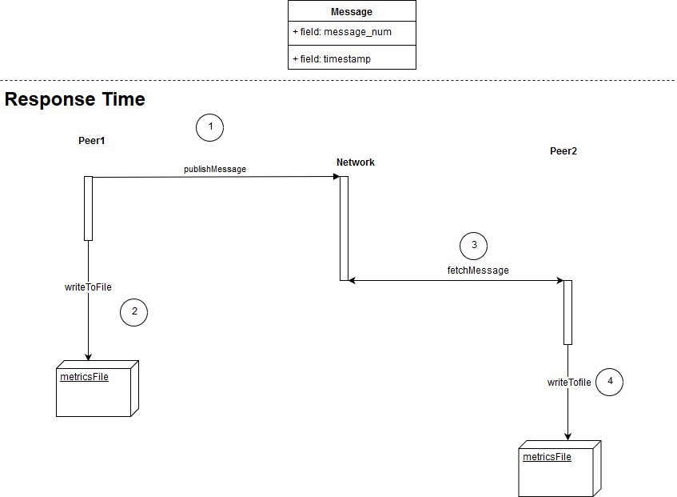
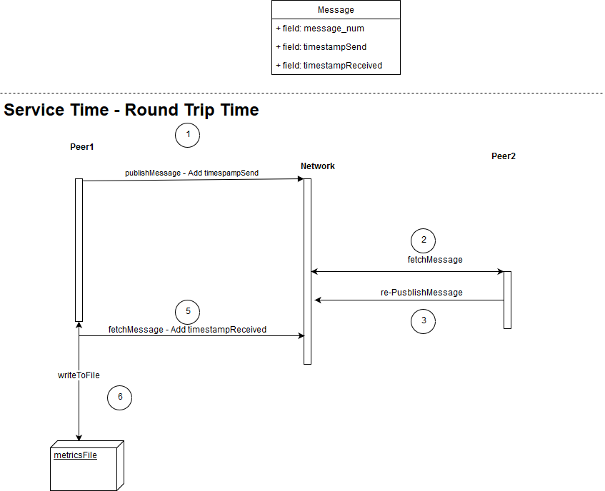

# IOTA-MAM-Thesis
Demo app using IOTA Masked Authenticated Messaging as part of my BSc thesis at ICSD, Univeristy of the Aegean. The project is based on IOTA MAM Library (https://github.com/iotaledger/mam.client.js) examples with some modifications.
# Response Time Diagram

# Service Time - Round Trip Time Diagram

